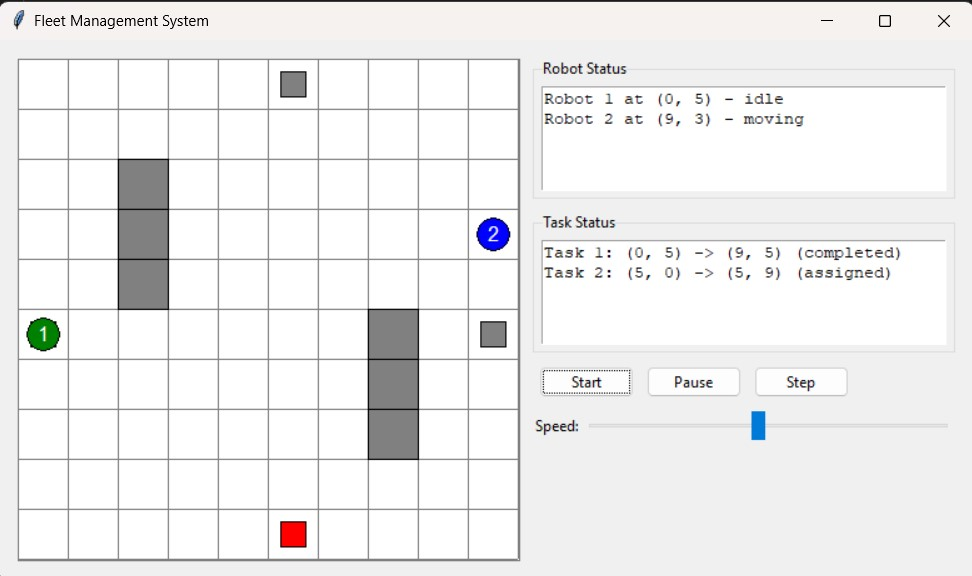

# Fleet Management System GUI

Overview

This project implements a modular GUI application for simulating a fleet management system in a warehouse environment. The application allows users to visualize robot movements, manage tasks, and monitor status updates in real time.

## Key Features

### Modular GUI Components

#### WarehouseCanvas
Handles the visual representation of the warehouse.
Displays robots, tasks, and obstacles.

#### StatusPanel
Shows detailed information about robot and task statuses in real time.

#### ControlPanel
Provides controls to start, pause, or step through the simulation.
Allows users to adjust the simulation speed.

#### MainWindow
The main application window that integrates all components seamlessly.

#### Interactive Features
Start/Pause Simulation: Begin or halt the simulation at any point.
Step-by-Step Execution: Execute the simulation step by step for detailed analysis.
Adjustable Simulation Speed: Control the speed of simulation using a slider.
Real-Time Status Updates: Continuously monitor the state of robots and tasks.

#### Visual Elements
Grid-Based Warehouse Display: Represents the warehouse layout.
Color-Coded Robots:

Green: Idle
Blue: Moving
Orange: Executing Task

#### Task Positions:
Green: Start
Red: End
Obstacles: Shown in gray.

Robot IDs: Displayed on robots for easy identification.
Status Information

#### Robot Status:
Position
State (Idle, Moving, Executing Task)

#### Task Status:
Pending
Assigned
Completed

#### Run the Application:
python src/main.py

Interface Layout:
Left Panel: Visual representation of the warehouse.
Right Panel: Status information and control buttons.
Control Buttons:

Start: Begin automatic simulation.

Pause: Pause the simulation.

Step: Execute the simulation one step at a time.
Adjust Simulation Speed:
Use the speed slider to control the speed of the simulation.
Code Design Principles

Separation of Concerns: Each component handles a specific responsibility.
Modularity: Independent and reusable modules.
Clean and Maintainable Code: Easy to extend and debug.
Real-Time Updates: Smooth and responsive status updates.
Proper Event Handling: Robust control flow for user interactions.

### Future Improvements
Add advanced task allocation algorithms.
Integrate more complex warehouse layouts.
Enhance robot interaction capabilities.
Include analytics for task and robot performance.

Author
Developed by Tejas Gupta

